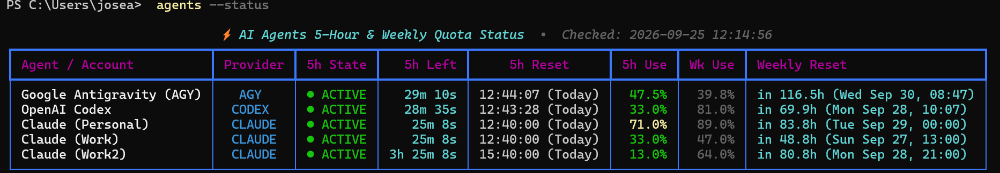
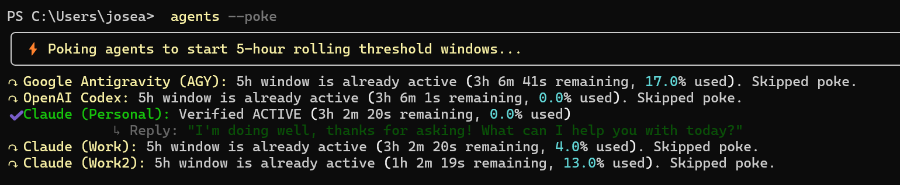
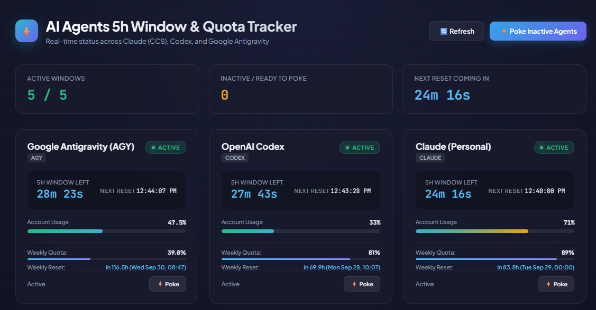

# ⚡ Agent Quota Tracker & 5-Hour Threshold Window Manager

[](LICENSE)
[](https://www.python.org/)
[](https://github.com/astral-sh/uv)
[](https://github.com/joseamair/agent-quota-tracker)
[](.github/workflows/ci.yml)

A lightweight, local quota monitoring system and web dashboard designed for developers managing multiple AI coding accounts. It automatically tracks **5-hour rolling threshold windows**, calculates **7-day weekly reset dates**, and provides a **verified smart poke engine** to start inactive quota countdowns on demand.

---

## 📑 Table of Contents

- [Supported Accounts](#-supported-accounts)
- [Key Features](#-key-features)
- [Architecture Overview](#-architecture-overview)
- [Quick Start](#-quick-start)
- [Account Configuration](#-account-configuration)
- [CLI Command Reference](#-cli-command-reference)
  - [`agents --status`](#1-agents---status--s)
  - [`agents --poke`](#2-agents---poke--p)
  - [`agents --poke-watch`](#3-agents---poke-watch)
  - [`agents --poke-at`](#4-agents---poke-at)
  - [`agents auto`](#5-agents-auto--agents---auto----auto-poke-autonomous-quota-auto-checker-loop--live-stream)
  - [`agents --schedule-install`](#6-agents---schedule-install----schedule-status----schedule-remove-os-background-priming)
  - [`agents --dashboard`](#7-agents---dashboard--d-web-dashboard-v2)
  - [`agents --status --json`](#8-agents---status---json)
  - [`agents --prompt`](#9-agents---prompt--agents---prompt-format-shell-prompt--status-bar-integration)
  - [`agents --status --watch`](#10-agents---status---watch--w)
  - [`agents --analytics`](#11-agents---analytics----insights--agents-analytics-quota-velocity--historical-burn-down)
  - [`agents --backfill`](#12-agents---backfill-historical-activity--schedule-log-importer)
  - [`agents --metrics`](#13-agents---metrics-prometheus-metrics-endpoint--cli-output)
  - [`agents export --csv`](#14-agents-export---csv-historical-timeseries-csv-export)
  - [`agents tui`](#15-agents-tui--agents---tui-interactive-full-screen-terminal-user-interface)
- [Global PowerShell Integration](#-global-powershell-integration)
- [Web Dashboard Preview](#-web-dashboard-preview)
- [Linux & macOS Compatibility & Setup Guide](#-linux--macos-compatibility--setup-guide)
- [Fork & Customize for Your Workflow](#-fork--customize-for-your-workflow)
- [Project Roadmap](#-project-roadmap)
- [Frequently Asked Questions (FAQ)](#-frequently-asked-questions-faq)
- [Security & Credential Privacy](#-security--credential-privacy)
- [Contributing](#-contributing)
- [Agent Handoff & Architecture Guide](HANDOFF.md)
- [Changelog](#-changelog)
- [License](#-license)

---

## 🤖 Supported Accounts

| Account / Agent | Provider | CLI / Integration | Quota Engine | Status |
|---|---|---|---|---|
| **Google Antigravity** | Google | `agy` CLI | Direct live quota (`agy -p "/usage" --output-format json`) | Stable |
| **OpenAI Codex** | OpenAI | `codex` CLI | Real-time JSON-RPC (`account/rateLimits/read`) | Stable |
| **Claude (Multi-Account)** | Anthropic | CCS profile (`~/.ccs/instances/`) | Instant live OAuth Usage API (`api.anthropic.com`) | Stable |
| **Claude (Standard CLI)** | Anthropic | Official `claude` (`~/.claude/`) | Direct OAuth Usage API with fallback to `claude -p` | Stable |
| **Cursor (Composer)** | Cursor / Anysphere | Local `state.vscdb` / JWT | Direct Usage API (`api2.cursor.sh/auth/usage`) | 🧪 Beta |
| **Windsurf (Cascade)** | Codeium | `~/.codeium/config.json` | Codeium User Metadata API | 🧪 Beta |
| **GitHub Copilot CLI** | GitHub | `gh auth token` / hosts.json | Copilot Internal Token API (`api.github.com/copilot_internal/v2/token`) | 🧪 Beta |
| **Aider / OpenRouter** | OpenRouter / Aider | Env `OPENROUTER_API_KEY` | OpenRouter Auth Key & Credit API (`openrouter.ai/api/v1/auth/key`) | 🧪 Beta |

> 📢 **Open for Community Testing & Contributions!**  
> Support for **Cursor**, **Windsurf**, **GitHub Copilot CLI**, and **Aider / OpenRouter** has been implemented based on official developer specs and reverse-engineered token discovery mechanisms.  
> If you have active subscriptions or tokens for any of these tools, we warmly invite you to enable them in your `agents.config.json` and share your feedback, validation reports, or pull requests to help refine and polish them!

> 💡 **Claude Multi-Account vs Single-Account Setup**:
> - **Multi-Account (`ccs`)**: By default, this dashboard tracks 3 distinct Claude profiles (`personal`, `work`, `work2`) using the [Claude Code Switcher (`ccs`)](https://github.com/joseamair/ccs) tool. Each profile keeps its own tokens in `~/.ccs/instances/<profile>`.
> - **Standard Claude CLI**: If you don't use `ccs` and only have a single official Anthropic Claude installation (Windows, macOS, or Linux), the tracker seamlessly supports it out of the box! It reads credentials directly from `~/.claude/.credentials.json` (or `~/.claude.json`) and pokes using `claude -p` directly. Simply set `"profile": "default"` or omit the profile in `agents.config.json`.
>
> 📖 **Deep Dive**: For full technical details on agent quota mechanics, sliding window heuristics, and peak-time priming strategies, see [AGENTS.md](AGENTS.md). For engineering guidelines, identity constraints, and context for incoming AI coding assistants, see [HANDOFF.md](HANDOFF.md).

---

## 🌟 Key Features

- **5-Hour Rolling Window Monitoring**: Displays live `● ACTIVE` vs `○ INACTIVE` states, exact time remaining countdowns (`Xh Ym Zs`), 5h % usage, and report check timestamps.
- **Weekly Reset Timestamps**: Calculates hours remaining until weekly quota resets, converting timestamps into local readable dates (e.g., `in 64.3h (Sun Sep 27, 12:59)`).
- **Verified Smart Poke Engine**:
  - Automatically skips active agents to prevent wasting quota tokens.
  - Sends a light prompt (`"Hello, how are you doing?"`) with non-interactive standard input (`stdin=DEVNULL`).
  - **Waits for the model to reply**, extracts a clean response snippet, and immediately re-queries provider APIs to verify live window activation.
  - Supports `--force` (`-f`) and `--agent` (`-a`) flags.
- **Automated Poke Watchdog (`--poke-watch`)**:
  - Continuous autonomous monitoring daemon that inspects 5-hour rolling windows and primes idle accounts automatically.
  - **Adaptive Sleep Engine**: Computes dynamic sleep duration based on earliest expiring active window (`min(remaining) + 45s`), eliminating CPU churn and API spam.
  - Supports fixed intervals (`--interval 30m`, `2h`, `7200s`).
- **Scheduled Target-Time Morning Priming (`--poke-at`)**:
  - Automatically primes 5-hour rolling threshold windows at a planned target time (`HH:MM`, e.g. `07:30`).
  - Automatically rolls over to the next morning if the target time has passed today.
  - Maximizes workday coding output: primes early so you receive a fresh 100% quota reset right in the middle of afternoon peak hours.
- **OS-Level Automated Task Generator (`--schedule-install`, `--schedule-status`, `--schedule-remove`)**:
  - Registers, inspects, and uninstalls persistent unattended background morning priming tasks directly with native OS schedulers:
    - **Windows**: Windows Task Scheduler (`ScheduledTasks` cmdlets) without requiring administrator elevation.
    - **Linux**: User `crontab`.
    - **macOS**: `launchd` LaunchAgent (`~/Library/LaunchAgents/com.agentquotatracker.priming.plist`).
  - Zero third-party dependencies; complete execution logging to `~/.agent_quota_tracker/schedule.log`.
- **Shell Prompt & Status Bar Integration (`--prompt`, `--prompt-format`)**:
  - Ultra-fast (<15ms) cached status segments for **Starship**, **Oh-My-Posh**, **tmux**, and **PowerShell `$PROFILE`**.
  - Dynamic mathematical countdown calculation from cached timestamps without background daemons.
- **Interactive Web Dashboard**:
  - Embedded HTTP server at `http://localhost:5050` with REST endpoints (`/api/status`, `/api/poke`).
  - Circular SVG progress rings, live ticking JavaScript countdown timers, and manual poke triggers.
- **Proactive Token Expiration & Auth Health Guard**:
  - Automatically checks local OAuth token expiration timestamps (e.g., Anthropic `.credentials.json` `expiresAt` epoch milliseconds) and Copilot token expirations prior to issuing HTTP requests.
  - Displays prominent `⚠️ EXPIRED` (bold red) and `⚠️ NO AUTH` (bold yellow) status badges on terminal tables and dashboard cards.
  - Renders a dedicated `🔐 Authentication Health Alerts` panel box on CLI and alert pills in Web Dashboard providing exact remediation commands (e.g. `ccs <profile> login`, `claude login`, `gh auth login`).
  - Guards automated poke tasks (`--poke`, `--auto`, `--poke-watch`, `--poke-at`) from dispatching prompts to expired accounts without `--force`.
- **Prometheus Metrics & CSV Timeseries Export**:
  - Live Prometheus 0.0.4 text-format exporter served at `GET /metrics` on the Web Dashboard and via `agents --metrics` CLI. Exposes gauge metrics (`agent_quota_used_percent`, `agent_weekly_used_percent`, `agent_time_remaining_seconds`, `agent_auth_valid`, etc.) with rich multi-attribute labels.
  - RFC 4180 CSV export for historical snapshots and priming logs via `agents export --csv` (with `--days N`, `--type snapshots|pokes`, and `--out <file>`) and `GET /api/export` on the Web Dashboard.
- **Interactive Full-Screen Terminal TUI (`agents tui`, `--tui`)**:
  - Full-screen keyboard-driven terminal dashboard running in an alternate screen buffer (`\033[?1049h`), leaving your previous shell scrollback untouched on exit.
  - Interactive row navigation (`↑`/`k`, `↓`/`j`), single-account poke (`p`), force poke (`f`), poke-all (`a`), instant refresh (`r`), live second-by-second countdown ticking, and selected account inspector panel.
- **Tri-Engine Implementation**:
  - Full Python package with Rich terminal formatting (`uv run agents` or `python -m agent_quota_tracker`).
  - Standalone single-file Python runner (`agents.py`).
  - Pure PowerShell native script (`agents_native.ps1`) for systems without Python.

---

## 🏗️ Architecture Overview

```text
                  ┌────────────────────────────────────────┐
                  │          agents CLI / Dashboard        │
                  │   (--status, --poke, --dashboard)      │
                  └──────────────────┬─────────────────────┘
                                     │
           ┌─────────────────────────┼─────────────────────────┐
           ▼                         ▼                         ▼
   ┌───────────────┐         ┌───────────────┐         ┌───────────────┐
   │ Claude (CCS)  │         │ OpenAI Codex  │         │ Google AGY    │
   │ 3 Profiles    │         │ Background RPC│         │ /usage Command│
   └───────┬───────┘         └───────┬───────┘         └───────┬───────┘
           │                         │                         │
           ▼                         ▼                         ▼
   Anthropic OAuth API       codex app-server        agy CLI /usage            
   api.anthropic.com         rateLimits/read         JSON Quota Output
```

---

## ⚡ Quick Start

### Prerequisites
- Windows 10/11 with PowerShell (`pwsh`)
- Python 3.11+ managed by [uv](https://github.com/astral-sh/uv)
- Installed CLIs: `agy` (Antigravity), `codex` (OpenAI), and `ccs` (Claude Code Switcher for multi-account) OR official `claude` (for single-account)

### Installation

1. Clone or download this repository:
   ```bash
   git clone https://github.com/joseamair/agent-quota-tracker.git
   cd agent-quota-tracker
   ```

2. Sync dependencies:
   ```bash
   uv sync
   ```

3. Run commands right away:
   ```powershell
   .\agents.ps1 --status
   ```

---

## 🎯 CLI Command Reference

### 1. `agents --status` (`-s`)
Displays a formatted status table across all accounts:

```powershell
.\agents.ps1 --status
# Or with native PowerShell:
.\agents_native.ps1 -Status
```

<p align="center">
  
</p>

---

### 2. `agents --poke` (`-p`)
Inspects 5-hour rolling threshold windows. Inactive accounts are poked with a light prompt to initiate their window; active accounts are skipped automatically.

<p align="center">
  
  <br>
  <em>"Wake up, agent! Time to start the 5-hour quota window." — Gently waking up dormant accounts before peak coding hours.</em>
</p>

```powershell
# Poke all inactive accounts:
.\agents.ps1 --poke

# Force poke an account even if active (useful for testing):
.\agents.ps1 --poke --force --agent work

# With native PowerShell:
.\agents_native.ps1 -Poke -Force -TargetAgent codex
```

<p align="center">
  
</p>

---

### 3. `agents --poke-watch`
Continuous autonomous watchdog daemon that monitors agent 5-hour quota windows and automatically primes accounts the moment they become idle.

```powershell
# Adaptive Mode (Default): sleeps until earliest expiring window (+45s safety margin)
.\agents.ps1 --poke-watch

# Fixed Polling Interval (e.g. check every 30 minutes or 2 hours):
.\agents.ps1 --poke-watch --interval 30m
.\agents.ps1 --poke-watch --interval 2h

# Enable native OS desktop toast notifications when accounts are primed:
.\agents.ps1 --poke-watch --notify

# With native PowerShell:
.\agents_native.ps1 -PokeWatch -Interval 30m -Notify
```

> 🧠 **Adaptive Sleep Engine**:  
> In adaptive mode (default), the daemon queries active accounts once, finds the earliest expiring 5-hour window, and sleeps for exactly that remaining duration plus a 45-second margin. It runs a live single-line terminal countdown timer (`⏳ Next check in: 1h 42m 15s remaining • Press Ctrl+C to cancel`), avoiding API query spam and CPU churn while guaranteeing instant priming when an account turns idle.

---

### 4. `agents --poke-at HH:MM`
Schedules an automated poke at a specific planned time of day (24-hour format) to prime accounts before your deep work starts.

```powershell
# Prime accounts tomorrow morning at 07:30 AM:
.\agents.ps1 --poke-at 07:30

# With desktop notification alert upon completion:
.\agents.ps1 --poke-at 07:30 --notify

# Verify desktop notifications on your system:
.\agents.ps1 --test-notify

# With native PowerShell:
.\agents_native.ps1 -PokeAt 07:30 -Notify
```

> 🎯 **Workday Double-Quota Strategy**:  
> If you start work at 09:00 AM and run a manual query, your 5-hour window runs until 02:00 PM. If you hit your quota by 12:00 PM, you're locked out until 02:00 PM.  
> By scheduling `agents --poke-at 07:30`, Window 1 starts early while you're offline. When you log in at 09:00 AM, you have full quota. At 12:30 PM (lunchtime / start of afternoon focus), **Window 1 resets back to 100%**, providing a full fresh allocation for the entire afternoon!  
> *(If the target time has already passed today, the tracker automatically rolls over to the next morning).*

---

### 5. `agents auto` / `agents --auto` / `--auto-poke` (Autonomous Quota Auto-Checker Loop & Live Stream)
Runs a continuous, fully autonomous monitoring and priming daemon with real-time in-place status table streaming:
1. **Initial Priming Check**: Immediately primes any dormant accounts that are currently idle and ready to poke (skipping accounts with $\ge 100\%$ weekly usage).
2. **Live In-Place Status Table Stream**: Continuously renders the full quota status table in-place using ANSI redraw and `rich.live.Live`, ticking active window countdowns second-by-second across all accounts.
3. **Zero-Token Quota Consumption Refetching**: Periodically re-queries local cache and provider OAuth usage endpoints (default every 15s via `--refresh-interval 15`) to keep `5h%` and `Wk%` metrics fresh as you write code, without consuming any LLM model generation tokens.
4. **Early Idle Detection**: Automatically triggers immediate window priming if an account's quota resets or cools down earlier than the scheduled timer.
5. **Live Ticking Countdown**: Displays target reset time and a live second-by-second countdown until the next scheduled poke: `⏳ Next poke target: <HH:MM:SS> (<Agent Name> (<time> left)) • Press Ctrl+C to stop`.
6. **Automatic Window Priming**: Automatically primes newly available quota windows the moment the timer is reached, then restarts the cycle endlessly.

```powershell
# Start autonomous auto-checker loop:
agents auto

# With custom table refresh interval (e.g. 10s or 30s):
agents auto --refresh-interval 30
# Or using the shorthand flag:
.\agents.ps1 --auto -ri 10

# With native desktop toast notifications when accounts are primed:
agents auto --notify

# With native PowerShell:
.\agents_native.ps1 -Auto -RefreshInterval 15 -Notify
```

---

### 6. `agents --schedule-install` / `--schedule-status` / `--schedule-remove` (OS Background Priming)
Registers an unattended OS-level background scheduled task to automatically prime your agents every morning, even when your terminal is closed or you have not logged in yet.

```powershell
# Install daily morning priming task (default: 07:30 AM) with desktop notifications:
.\agents.ps1 --schedule-install 07:30 --notify

# Check status, state, next run time, and recent execution logs:
.\agents.ps1 --schedule-status

# Uninstall and remove the background scheduled task:
.\agents.ps1 --schedule-remove

# Using positional subcommands:
uv run agents schedule install 07:30
uv run agents schedule status
uv run agents schedule remove

# With native PowerShell:
.\agents_native.ps1 -ScheduleInstall 07:30 -Notify
.\agents_native.ps1 -ScheduleStatus
.\agents_native.ps1 -ScheduleRemove
```

| OS Platform | Scheduler Backend | Configuration / Storage Path |
|---|---|---|
| **Windows** | Windows Task Scheduler | Task: `AgentQuotaTrackerMorningPriming` |
| **Linux** | User Crontab | `crontab -l` (`# AgentQuotaTrackerMorningPriming`) |
| **macOS** | launchd LaunchAgent | `~/Library/LaunchAgents/com.agentquotatracker.priming.plist` |

All executions and outcomes are persisted in `~/.agent_quota_tracker/schedule.log`.

---

### 7. `agents --dashboard` (`-d`) (Web Dashboard v2)
Spins up the local web dashboard at `http://localhost:5050` and automatically opens it in your default browser.

```powershell
.\agents.ps1 --dashboard
# Or with native PowerShell:
.\agents_native.ps1 -Dashboard
```

**Web Dashboard v2 Highlights:**
- ⚡ **Real-Time Push Updates (SSE)**: Streams live quota status through Server-Sent Events (`/api/stream`) with zero-latency push when actions occur, accompanied by a live connection status badge (`🟢 Live SSE Stream` / `🟡 Polling Fallback`).
- 🔘 **Interactive Priming Controls**: Trigger individual agent pokes (`⚡ Poke` or `⚡ Force Poke`) directly from their cards with in-flight loading spinners, or prime all dormant accounts at once via `⚡ Poke All Idle`.
- ⏰ **Morning Priming Modal**: Inspect, install, and remove OS-level background scheduled tasks (`GET /api/schedule`, `POST /api/schedule`) directly in an interactive glassmorphic modal.
- 🎨 **Multi-Theme Engine**: Switch between **Glassmorphism Dark** (default), **Cyberpunk OLED**, and **Minimal Light** themes with instant CSS switching and `localStorage` persistence.
- ⏱️ **Live Client-Side Timers**: Independent ticking countdown timers on each active card updating second-by-second without waiting for full server polls.

> **💡 Quick 1-Click Desktop Launcher**:  
> Double-click `start-dashboard.cmd` directly from Windows Explorer or your desktop to start the dashboard server and open your browser instantly!

<p align="center">
  
</p>

---

### 8. `agents --status --json`
Outputs raw machine-readable JSON status for all tracked accounts (ideal for custom status bars, polybars, tmux, and automation):

```powershell
.\agents.ps1 --status --json
# Or with uv:
uv run agents --json
```

---

### 9. `agents --prompt` / `agents --prompt-format` (Shell Prompt & Status Bar Integration)
Ultra-fast (<15ms) cached status segments for custom shell prompts (**Starship**, **Oh-My-Posh**, **PowerShell `$PROFILE`**) and status lines (**tmux**, **Waybar**, **Polybar**).

```powershell
# Default format: [⚡ 3/5 Active • 2h14m]
.\agents.ps1 --prompt

# Compact format: ⚡3/5 2h14m
.\agents.ps1 --prompt-format compact

# Minimal format: 🤖 3/5
.\agents.ps1 --prompt-format minimal

# Tmux format with colored segment:
.\agents.ps1 --prompt-format tmux

# JSON payload for custom widget parsers:
.\agents.ps1 --prompt-format json

# Custom template with dynamic tokens:
.\agents.ps1 --prompt-format "⚡ {active}/{total} ({percent}) left: {min_remaining}"

# With native PowerShell:
.\agents_native.ps1 -Prompt
.\agents_native.ps1 -PromptFormat compact
```

> ⚡ **Sub-10ms Zero-Overhead Cache Engine**:  
> Prompt evaluations read from local disk cache (`~/.agent_quota_tracker/cache.json`), avoiding network calls on every shell prompt render. The engine dynamically computes live countdowns second-by-second from cached timestamps, ensuring 100% time accuracy with zero background CPU churn! Run `agents --prompt --refresh` or `agents --status` to refresh provider data anytime.

#### 🚀 Integration Guides:

##### Starship Prompt (`~/.config/starship.toml`)
```toml
[custom.agents_quota]
command = "agents --prompt"
when = "true"
style = "bold yellow"
format = "[$output]($style) "
```

##### Tmux Status Line (`~/.tmux.conf`)
```tmux
set -g status-right '#(agents --prompt-format tmux) | %H:%M '
```

##### PowerShell `$PROFILE` Prompt
```powershell
# Add to your $PROFILE:
function prompt {
    $quota = & agents --prompt-format compact
    "PS $pwd $quota> "
}
```


**Sample Output:**
```json
[
  {
    "id": "agy",
    "name": "Google Antigravity (AGY)",
    "provider": "AGY",
    "category": "personal",
    "is_active": true,
    "used_percent": 47.9,
    "time_remaining_str": "3h 34m 10s",
    "weekly_used_percent": 23.8,
    "weekly_reset_str": "in 128.6h (Wed Sep 30, 08:47)"
  }
]
```

---

### 10. `agents --status --watch` (`-w`)
Continuously refreshes the quota status table in your terminal every N seconds (default: 15s) with a clear screen:

```powershell
# Refresh every 15 seconds:
.\agents.ps1 --status --watch

# Custom interval (e.g. 30 seconds):
.\agents.ps1 --watch 30
```

---

### 11. `agents --analytics` / `--insights` / `agents analytics` (Quota Velocity & Historical Burn-Down)
Analyzes historical usage patterns and quota velocity logged to the embedded SQLite database (`~/.agent_quota_tracker/history.db`):
- **Active Time Ratio**: Percentage of tracked time with active 5-hour quota windows.
- **Peak Consumption Hours**: Top 3 diurnal hours of highest prompt activity throughout the day.
- **Recommended Morning Priming Time**: Mathematically derived priming schedule (e.g. 07:30) calculated from your first morning usage spike to ensure your 5-hour window resets directly at midday without midday lockouts.
- **24-Hour Diurnal Distribution**: Terminal bar chart visualizing activity intensity across all 24 hours of the day.
- **Per-Account Peak Breakdown**: Tracks max 5-hour utilization percentage and total active session counts per agent.

```powershell
# Analyze past 7 days (default):
.\agents.ps1 --analytics

# Analyze past 14 or 30 days:
.\agents.ps1 --analytics --days 14

# With positional alias:
uv run agents analytics

# With native PowerShell:
.\agents_native.ps1 -Analytics -Days 7
```

---

### 12. `agents --backfill` (Historical Activity & Schedule Log Importer)
Scans legacy priming logs (`~/.agent_quota_tracker/schedule.log`) and state cache (`~/.agents_dashboard/state.json`) and ingests them into the SQLite timeseries database (`~/.agent_quota_tracker/history.db`):
- **Zero-Duplicate Guard**: Checks existing timestamps and agent IDs to guarantee idempotency.
- **Immediate Insights**: Instantly populates historical diurnal charts and burn-down analytics without waiting days to collect new data.
- **Web Dashboard**: Also available via the interactive **📥 Backfill** button in the Web Dashboard header.

```powershell
# Run historical backfill importer:
agents --backfill

# With standalone script:
python agents.py --backfill

# With native PowerShell:
.\agents_native.ps1 -Backfill
```

---

### 13. `agents --metrics` (Prometheus Metrics Endpoint & CLI Output)
Exposes agent quota and health metrics in standard **Prometheus version 0.0.4 text format** for scraping by Prometheus, VictoriaMetrics, or Datadog:
- **Available Gauges**:
  - `agent_quota_tracker_up`: Daemon liveness indicator (always 1).
  - `agent_quota_used_percent`: 5-hour rolling threshold window utilization percent (0.0 to 100.0).
  - `agent_quota_remaining_fraction`: Remaining 5-hour quota expressed as a fraction (0.0 to 1.0).
  - `agent_weekly_used_percent`: 7-day rolling window quota utilization percent (0.0 to 100.0).
  - `agent_time_remaining_seconds`: Remaining seconds on active 5-hour rolling window (0 if inactive).
  - `agent_is_active`: Binary gauge (1 if active window running, 0 if inactive/idle).
  - `agent_auth_valid`: Authentication status gauge (1 if valid, 0 if expired or unauthenticated).
- **Metric Labels**: Includes `id`, `name`, `provider`, and `category` tags on each metric line.
- **Web Dashboard Integration**: Automatically served at `http://localhost:5050/metrics`.

```powershell
# Output Prometheus metrics to stdout:
agents --metrics
# Or via subcommand:
agents metrics

# Standalone Python runner:
python agents.py --metrics

# With native PowerShell:
.\agents_native.ps1 -Metrics

# Web Dashboard scrape endpoint:
curl http://localhost:5050/metrics
```

---

### 14. `agents export --csv` (Historical Timeseries CSV Export)
Exports historical quota snapshots and priming audit logs stored in SQLite (`~/.agent_quota_tracker/history.db`) to standard RFC 4180 CSV format:
- **Supported Export Types**:
  - `snapshots` (default): Timestamped records of 5-hour usage, weekly usage, remaining seconds, active state, and auth validity.
  - `pokes`: Timestamped audit trail of priming events, exit codes, latency, and model verification responses.
- **Filtering Options**: Filter by recency using `--days <N>` (e.g. past 7, 14, 30 days) or filter to a single agent with `--agent <id>`.
- **Output Destination**: Prints directly to standard output (ideal for piping to `jq`, `grep`, or file redirection) or writes directly to disk with `--out <file>`.
- **Web Dashboard**: Also available via direct download link or `GET /api/export?type=snapshots&days=7`.

```powershell
# Export past 7 days of quota snapshots to stdout:
agents export --csv

# Export past 30 days of snapshots to a CSV file:
agents export --csv --days 30 --out snapshots_30d.csv

# Export priming verification logs:
agents export --csv --type pokes --days 14 --out pokes.csv

# Standalone Python runner:
python agents.py --export-csv --days 7 --out history.csv

# With native PowerShell:
.\agents_native.ps1 -ExportCsv -Days 7
```

---

### 15. `agents tui` / `agents --tui` (Interactive Full-Screen Terminal User Interface)
An immersive, full-screen, keyboard-driven terminal dashboard designed for terminal power users who want live monitoring and control right in their active shell:
- **Full-Screen Alternate Buffer**: Runs in terminal alternate buffer (`\033[?1049h`), ensuring that when you exit with `q` or `Esc`, your active terminal scrollback history is preserved 100% cleanly.
- **Interactive Keyboard Controls**:
  - `↑` / `k`: Navigate selection up through tracked accounts.
  - `↓` / `j`: Navigate selection down through tracked accounts.
  - `p`: Trigger smart poke on the selected account (if currently idle).
  - `f`: Force poke the selected account (even if already active).
  - `a`: Poke all currently idle accounts in one command.
  - `r`: Force immediate status re-fetch from provider APIs and local cache.
  - `?` or `h`: Toggle interactive floating help overlay modal.
  - `q` or `Esc`: Cleanly exit the TUI and restore standard terminal cursor and colors.
- **Live Panels & Inspector**:
  - **Header Bar**: Live active account count, earliest reset window countdown, and local clock.
  - **Accounts Table**: Interactive table with row highlight cursor (`▶`), 5h state badges (`● ACTIVE`, `○ INACTIVE`, `⚠️ EXPIRED`, `⚠️ NO AUTH`), live ticking remaining time, and Unicode progress bars.
  - **Selected Account Inspector**: Real-time panel displaying category, ID, provider, exact reset timestamps, utilization breakdown, and token remediation instructions if authentication requires attention.
  - **Activity & Status Log**: Feedback bar reporting results of pokes, skips, and API refreshes in real time.

```powershell
# Launch interactive TUI:
agents tui
# Or with flag:
agents --tui

# Custom live API refresh interval (default: 15s):
agents tui --refresh-interval 20

# With desktop notifications on primed accounts:
agents tui --notify

# Standalone Python runner:
python agents.py --tui

# With native PowerShell:
.\agents_native.ps1 -Tui
```

---

## ⚙️ Account Configuration

Tracked accounts and display order are configured in `agents.config.json` (or `~/.agents_dashboard/config.json`). By default, personal accounts are grouped at the top, followed by work accounts:

```json
{
  "accounts": [
    { "id": "agy", "provider": "agy", "name": "Google Antigravity (AGY)", "category": "personal", "enabled": true },
    { "id": "codex", "provider": "codex", "name": "OpenAI Codex", "category": "personal", "enabled": true },
    { "id": "personal", "provider": "claude", "profile": "personal", "name": "Claude (Personal)", "category": "personal", "enabled": true },
    { "id": "work", "provider": "claude", "profile": "work", "name": "Claude (Work)", "category": "work", "enabled": true },
    { "id": "work2", "provider": "claude", "profile": "work2", "name": "Claude (Work2)", "category": "work", "enabled": true }
  ]
}
```

You can customize names, disable specific agents (`"enabled": false`), or adjust order by editing `agents.config.json` (template provided in `agents.config.example.json`).

---

## 🌐 Global PowerShell Integration

To make `agents` available from **any folder** in PowerShell without typing paths, add this 3-line function to your PowerShell profile (`C:\Users\<user>\Documents\PowerShell\Microsoft.PowerShell_profile.ps1`):

```powershell
# AI Agents 5-Hour Quota Tracker & Dashboard
function agents {
    & "$HOME\path\to\agent-quota-tracker\agents.ps1" @args
}
```

Now you can simply type:
```powershell
agents --status
agents --poke
agents --dashboard
```

---

## 🖥️ Web Dashboard Preview

The embedded dashboard runs locally at `http://localhost:5050`, featuring real-time glassmorphism status cards, active countdown rings, and manual poke triggers:

<p align="center">
  
</p>

---

## 🐧 Linux & 🍎 macOS Compatibility & Setup Guide

`agent-quota-tracker` is cross-platform and natively supported on **Ubuntu, Debian, Fedora, Arch Linux, and macOS**.

### 1. Running with POSIX Bash (`agents.sh`)

Make the script executable:
```bash
chmod +x agents.sh
./agents.sh --status
./agents.sh --poke
./agents.sh --dashboard
```

### 2. Global Shell Alias (`bash`, `zsh`, `fish`)

Add this alias to your shell profile (`~/.bashrc`, `~/.zshrc`, or `~/.config/fish/config.fish`):

```bash
# In ~/.bashrc or ~/.zshrc:
alias agents="$HOME/path/to/agent-quota-tracker/agents.sh"
```

Reload your profile (`source ~/.bashrc` or `source ~/.zshrc`) to run `agents` from any working directory!

### 3. Cross-Platform Path Mapping

Provider credentials and configurations are mapped automatically from your standard home directory:
- **Anthropic CCS**: `~/.ccs/instances/`
- **Claude CLI cache**: `~/.claude.json`
- **OpenAI Codex**: `~/.codex/`
- **Google Antigravity**: `~/.gemini/antigravity-cli/`
- **Quota Tracker Config**: `~/.agent_quota_tracker/config.json` (or local `agents.config.json`)

---

## 🍴 Fork & Customize for Your Workflow

`agent-quota-tracker` is built to be modular, hackable, and instantly extensible for your specific team or personal agent setups. 

[](https://github.com/joseamair/agent-quota-tracker/fork)
[](https://github.com/joseamair/agent-quota-tracker)

### Why Fork This Repo?
- **Tailor Your Account Fleet**: Edit `agents.config.json` to monitor 1 account, 10 accounts, or cross-company setups across personal laptops, cloud workstations, or VPS instances.
- **Add New Agent Trackers**: Add plug-and-play trackers under [`src/agent_quota_tracker/trackers/`](src/agent_quota_tracker/trackers/) by implementing the base `AgentTracker` interface.
- **Hook Into Custom Pipelines**: Use `agents --status --json` to pipe real-time agent capacity into your custom polybars, tmux status lines, internal developer portals, or Slack/Discord webhooks.
- **Contributions Welcome**: Submit your improvements, new provider trackers, or custom UI themes as Pull Requests!

---

## 🗺️ Project Roadmap

### 🚀 Delivered in v1.2.1
- [x] **Live In-Place Status Table Stream for Auto-Checker (`agents auto`, `--auto-poke`)** ([#42](https://github.com/joseamair/agent-quota-tracker/pull/42)): Real-time second-by-second active countdown ticker, periodic zero-prompt-token quota utilization refetching (default every 15s via `--refresh-interval`), and early idle detection. Full Tri-Engine Parity.

### 🚀 Delivered in v1.2.0
- [x] **Interactive Web Dashboard Charts & Inspection Controls** ([#41](https://github.com/joseamair/agent-quota-tracker/issues/41), [#40](https://github.com/joseamair/agent-quota-tracker/pull/40)): Crosshair scrubbing, point halos, floating tooltips, 4-metric selection (5h %, weekly %, time left, tokens), per-account filter checkboxes with `localStorage` persistence, and timeline box drag-to-zoom with reset button.
- [x] **Web Dashboard v2 with Live SSE Push Updates & Interactive Controls** ([#24](https://github.com/joseamair/agent-quota-tracker/issues/24)): Server-Sent Events (SSE) `/api/stream` updates, per-card "⚡ Poke" & "⚡ Force Poke" buttons, in-browser morning priming configuration modal (`/api/schedule`), and 3 themes (Dark, OLED, Light).
- [x] **Local SQLite Historical Analytics & Quota Velocity Burn-Down Charts** ([#23](https://github.com/joseamair/agent-quota-tracker/issues/23)): Embedded timeseries database (`history.db`), peak-hour detection, optimal morning priming calculation, CLI `--analytics` (`--insights`), and interactive 7-day SVG burndown and 24h diurnal heatmap charts.
- [x] **Historical Poke & Activity Backfill Importer** ([#37](https://github.com/joseamair/agent-quota-tracker/pull/37)): Multi-source scanner parsing legacy logs into SQLite `history.db` (`agents --backfill`, dashboard `📥 Backfill`).
- [x] **Autonomous Continuous Auto-Checker Loop (`agents auto`, `--auto-poke`)** ([#31](https://github.com/joseamair/agent-quota-tracker/issues/31)): Hands-free loop checking status, waiting for earliest window reset, priming idle accounts, and running a live ticking terminal countdown.
- [x] **Native Desktop Toast Notifications (`--notify`, `--test-notify`)** ([#20](https://github.com/joseamair/agent-quota-tracker/issues/20)): Zero-dependency native notifications for Windows, macOS, and Linux on poke events, cooldowns, and schedules.
- [x] **OS-Level Scheduled Morning Priming Task Generator (`--schedule-install`)** ([#22](https://github.com/joseamair/agent-quota-tracker/issues/22)): Windows Task Scheduler, Linux crontab, and macOS launchd background task generator operating safely in user space.
- [x] **Shell Prompt & Status Bar Integration (`--prompt`, `--prompt-format`)** ([#25](https://github.com/joseamair/agent-quota-tracker/issues/25)): Fast cached status segments for Starship, Oh-My-Posh, tmux, and PowerShell `$PROFILE`.
- [x] **Additional AI Agent Trackers (Beta)** ([#21](https://github.com/joseamair/agent-quota-tracker/issues/21)): Modular trackers for Cursor, Windsurf, GitHub Copilot CLI, and Aider/OpenRouter.
- [x] **Weekly Quota Exhaustion Guard & Sliding Window Ceiling Fix** ([#29](https://github.com/joseamair/agent-quota-tracker/issues/29)): Accurate 5h idle detection and safety guard skipping accounts with $\ge 100\%$ weekly usage unless `--force`.

### 🚀 Delivered in v1.1.0
- [x] **Automated Poke Watchdog Mode (`--poke-watch`)** ([#18](https://github.com/joseamair/agent-quota-tracker/issues/18)): Autonomous daemon with dynamic adaptive cooling engine based on earliest expiring active window.
- [x] **Scheduled Target-Time Poke (`--poke-at`)** ([#19](https://github.com/joseamair/agent-quota-tracker/issues/19)): Strategic morning priming with automatic overnight clock rollover.
- [x] **Terminal Status Report Timestamp** ([#15](https://github.com/joseamair/agent-quota-tracker/issues/15)): Explicit check timestamp displayed on the status table header.
- [x] **AGY & Codex False-Positive Quota Fixes** ([#16](https://github.com/joseamair/agent-quota-tracker/issues/16)): Strict idle window verification for sliding prospective timestamps.
- [x] **Official Claude CLI Support**: Native single-account discovery and fallback to official Anthropic `claude` CLI.

### 🔭 Future Roadmap (v1.3.0 & Beyond)
- [ ] **Track Repository Visitor Traffic and Views using Free GitHub Native APIs & Actions** ([#36](https://github.com/joseamair/agent-quota-tracker/issues/36)): Scheduled GitHub Action querying Traffic API with cumulative timeseries storage and `agents traffic` CLI / Dashboard widget.
- [ ] **Proactive Token Expiration & Auth Health Guard**: Desktop notification and `⚠️ EXPIRED` badge when OAuth tokens expire.
- [ ] **Webhook Alerts (Discord / Slack / Telegram)**: Remote notifications for headless servers and homelabs on morning priming and weekly quota thresholds.

---

## ❓ Frequently Asked Questions (FAQ)

<details>
<summary><b>Does poking consume expensive tokens or count as quota usage?</b></summary>
<br>
The poke engine sends a lightweight greeting prompt (<code>"Hello, how are you doing?"</code>) with <code>stdin=DEVNULL</code>. This triggers the provider's rolling 5-hour window countdown without running commands or consuming significant prompt tokens. Active windows are automatically skipped.
</details>

<details>
<summary><b>How are credentials protected?</b></summary>
<br>
All API calls are directed strictly to official provider endpoints (such as <code>https://api.anthropic.com/api/oauth/usage</code>). Tokens are read in local memory only and never written to logs, committed to Git, or sent to third-party telemetry.
</details>

<details>
<summary><b>Can I reorder or disable specific accounts?</b></summary>
<br>
Yes! Edit <code>agents.config.json</code> (or copy from <code>agents.config.example.json</code>). You can toggle <code>"enabled": false</code> or change the array ordering to your preference.
</details>


---

## 🔒 Security & Credential Privacy

This project is built following strict local security guidelines:
- **Zero External Telemetry**: Access tokens from `~/.ccs/instances/` and `~/.claude.json` are read exclusively in local memory.
- **Direct Official Endpoints**: Outbound requests are directed strictly to official API endpoints (`api.anthropic.com`).
- For detailed information, see [SECURITY.md](SECURITY.md).

---

## 🤝 Contributing

Contributions, issues, and feature requests are welcome!  
Please read [CONTRIBUTING.md](CONTRIBUTING.md) and [CODE_OF_CONDUCT.md](CODE_OF_CONDUCT.md) for details on code style, testing, and adding new AI agent trackers.

---

## 📝 Changelog

Detailed release notes and version history are maintained in [CHANGELOG.md](CHANGELOG.md).

---

## 📄 License

This project is open-source and licensed under the [MIT License](LICENSE).
